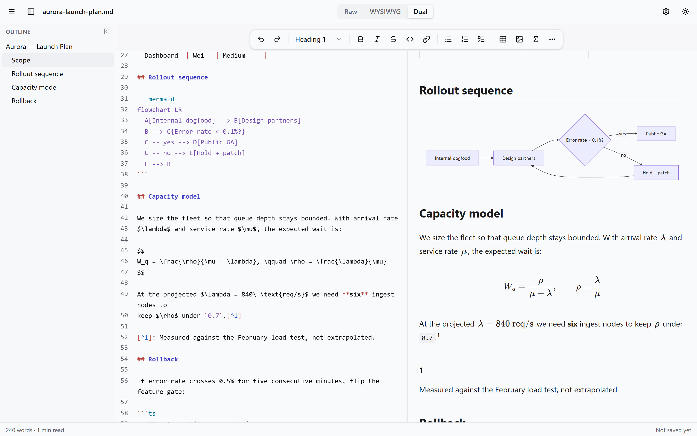
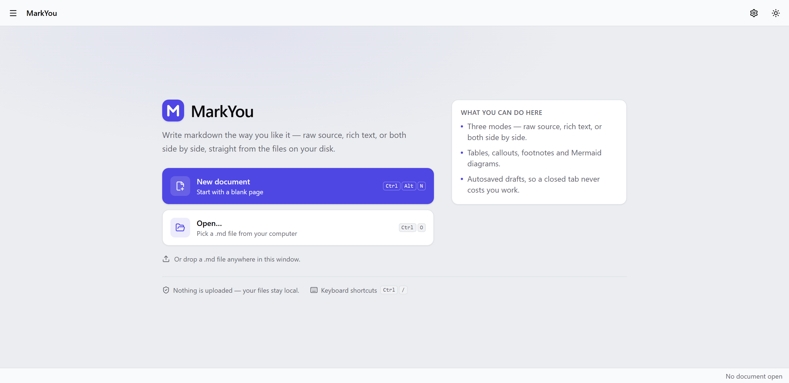
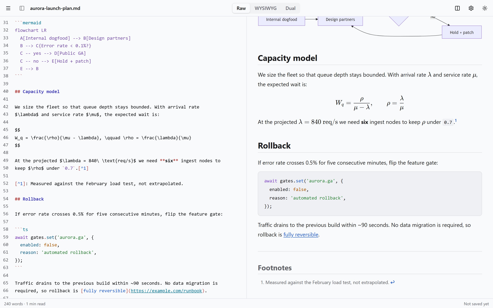
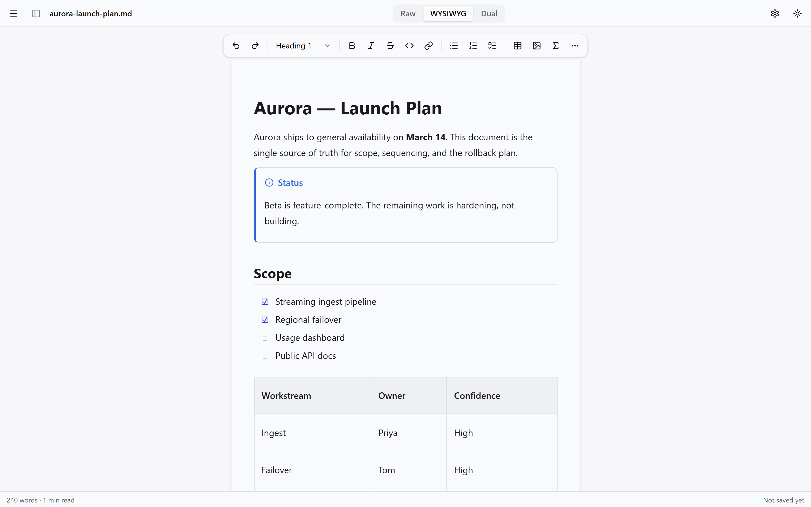
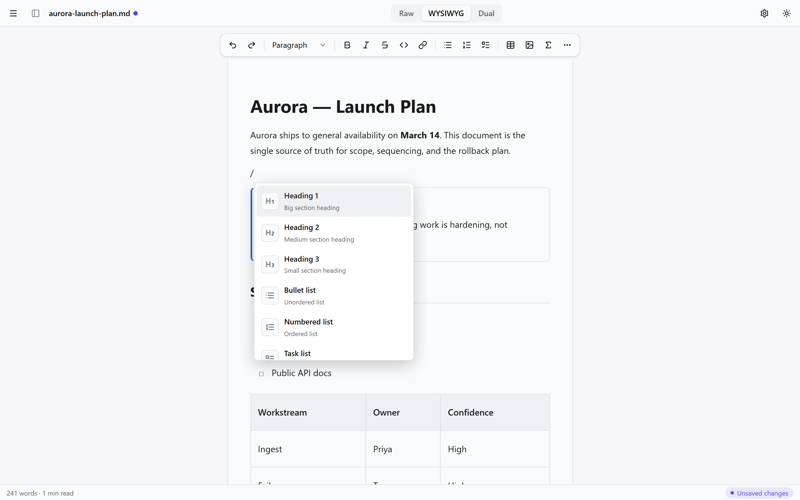
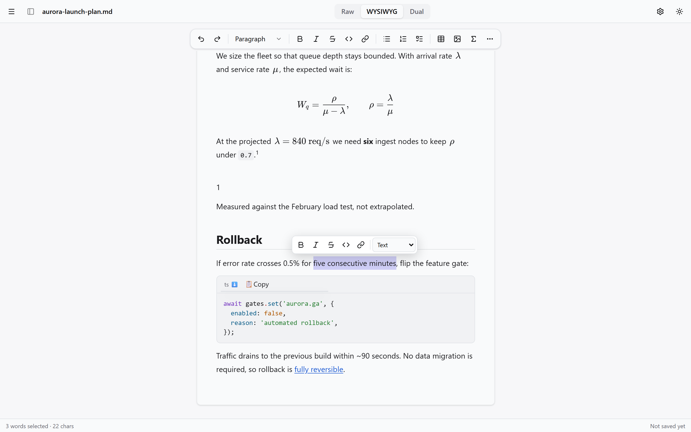
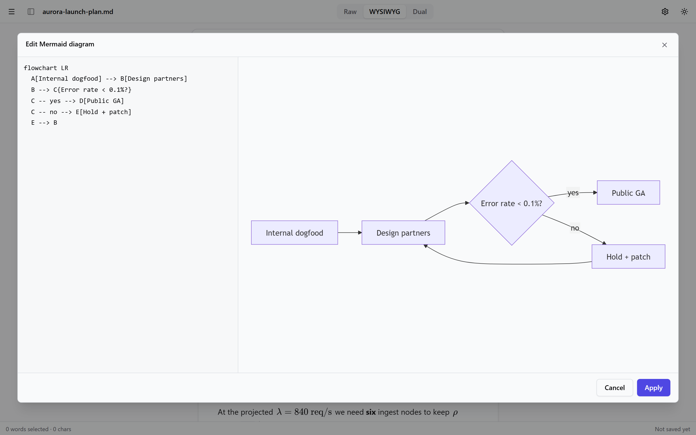
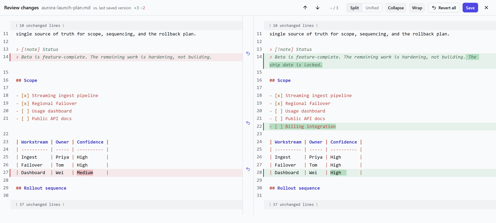
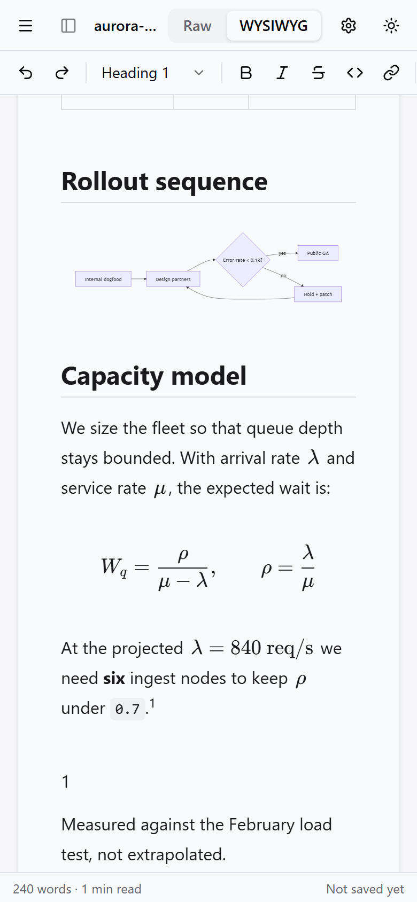

<div align="center">


# MarkYou

**Write markdown the way you like it — raw source, rich text, or both side by side.**

Straight from the `.md` files on your disk. No account, no upload, no lock-in.

[**→ Open the app**](https://markyou.web.app/) · [Guided tour](#a-guided-tour) · [Contributing](#contributing)

[](https://github.com/ntson9p/markyou/actions/workflows/ci.yml)
[](LICENSE)
[](#install-it-like-an-app)
[](#privacy-the-short-version)

<picture>
  <source media="(prefers-color-scheme: dark)" srcset="docs/screenshots/hero-dark.png">
  
</picture>

</div>

---

## Why you might like it

Most markdown editors make you choose a side. Source editors give you exact control but
you read syntax instead of prose. Rich editors are pleasant until they quietly rewrite
your file into their own dialect. Cloud editors are pleasant until your notes live on
someone else's server.

MarkYou refuses the trade.

**Three views, one document.** Raw source, WYSIWYG, or both side by side — switch
mid-sentence with `Ctrl+Shift+1/2/3`. Not three files, not three copies. One document,
three ways to look at it.

**Your files stay yours.** It opens the real `.md` file on your disk and saves back to it
in place. No import step, no export step, no proprietary vault. Close the app and your file
is exactly where you left it.

**Raw mode never reformats you.** Type in the source pane and the app writes back byte for
byte. It will not re-wrap your paragraphs, re-order your link definitions, or "helpfully"
turn your `*` bullets into `-`.

**See what changed before you save.** `Ctrl+Shift+D` diffs your unsaved edits against the
file on disk, chunk by chunk, and lets you revert any one of them.

**Works with the network off.** Installable PWA, fully client-side. No account, no server
round-trip, no telemetry. Airplane mode is a supported configuration.

**Batteries included.** Tables, task lists, footnotes, callouts, KaTeX math, Mermaid
diagrams, images, frontmatter, outline, find & replace, version snapshots, and HTML/PDF
export.

> **New to the project?** The fastest way to judge it is to
> [open the app](https://markyou.web.app/) and drop one of your own `.md` files onto the
> window. Nothing is uploaded — you can check the network tab.

---

## Try it in 60 seconds

1. Go to **[markyou.web.app](https://markyou.web.app/)**.
2. Click **New document**, or drag any `.md` file anywhere onto the window.
3. Write something. Press `Ctrl+S`.

That's it. On Chrome or Edge, step 3 writes straight back to the file you opened. There is
no sign-up, no onboarding tour, and nothing to configure first.

<div align="center">
  
</div>

---

## A guided tour

Everything below is a real screenshot of the app, not a mockup.

### 1. Pick the view that fits what you're doing

The mode switcher sits in the title bar, and every mode edits the **same** document —
your cursor position and scroll roughly follow you across the switch.

<table>
<tr>
<td width="33%"><b>Raw</b> <code>Ctrl+Shift+1</code><br>Syntax-highlighted source with a live preview beside it. The two scroll together.</td>
<td width="33%"><b>WYSIWYG</b> <code>Ctrl+Shift+2</code><br>Formatted text, styled like a page. Headings look like headings.</td>
<td width="33%"><b>Dual</b> <code>Ctrl+Shift+3</code><br>Source and rich text side by side, editing the same document live.</td>
</tr>
</table>

Raw mode with the scroll-synced preview — note the source on the left and the rendered
math, code and footnotes on the right, parked at the same place in the document:



### 2. Write in rich text, save plain markdown

WYSIWYG mode renders callouts, task lists and tables as real formatted blocks. What lands
on disk is still ordinary markdown that GitHub, Obsidian and `pandoc` all understand.



### 3. Insert any block by typing `/`

Type `/` at the start of an empty line to get headings, lists, quotes, callouts, code
blocks, tables, math blocks, Mermaid diagrams, dividers and images. Keep typing to filter
— `/tab` finds the table.



### 4. Format without leaving the sentence

Select text and a bubble menu appears with bold, italic, strikethrough, inline code, link,
and a block-type dropdown. The status bar counts your selection as you go.



<details>
<summary><b>Prefer the keyboard?</b> Every formatting command has a shortcut.</summary>

| Action                        | Keys                                 |
| ----------------------------- | ------------------------------------ |
| Bold / Italic / Strikethrough | `Ctrl+B` / `Ctrl+I` / `Ctrl+Shift+X` |
| Inline code                   | `Ctrl+E`                             |
| Link                          | `Ctrl+K`                             |
| Heading 1 / 2 / 3             | `Ctrl+Alt+1` / `2` / `3`             |
| Bullet / Ordered / Task list  | `Ctrl+Shift+8` / `7` / `9`           |
| Quote                         | `Ctrl+Shift+B`                       |

Press `Ctrl+/` in the app for the full, searchable list. On macOS, use `Cmd` for `Ctrl`.

</details>

### 5. Diagrams and math that render as you type

Mermaid diagrams and KaTeX math are first-class. Click any diagram to open a full-screen
editor with the source on one side and a live preview on the other — nothing is written
back to your document until you press **Apply**.



### 6. Review your changes before you save

This is the feature people don't expect in a markdown editor. `Ctrl+Shift+D` shows a real
diff of your unsaved work against the file on disk: word-level highlighting, collapsed
unchanged regions, per-chunk revert, and Save right there in the header.



### 7. Losing work is designed out

Three independent safety nets, all local:

- **Draft guard** — your keystrokes are mirrored to a local draft about once a second. Kill
  the tab, crash the browser, lose power: a recovery banner offers your work back next time.
- **Version snapshots** — the app quietly keeps timestamped snapshots (roughly every five
  minutes while you edit, thinned out as they age). Open **History** from the menu to diff
  any snapshot against now and restore it.
- **Leave warning** — closing a tab with unsaved changes asks first.

### 8. Images, without a media library

Paste or drop an image into either editor. On Chrome and Edge you can point the app at an
`assets/` folder once, and images are written there as ordinary files with relative links —
the way a static-site generator wants them. Elsewhere they embed as base64, with a warning
when that's about to bloat your file.

### 9. Take it out again

Export to a standalone HTML file (styles inlined, opens anywhere), print to PDF, or copy
the whole document as rich text and paste it into Google Docs, Word or an email.

### 10. It works on a phone

Single pane, touch formatting through the bubble menu, and the same rendering — diagrams
and math included. The toolbar stays above the virtual keyboard.

<div align="center">
  
</div>

---

## What it understands

Baseline **CommonMark**, plus:

| Extension     | Syntax                                           |
| ------------- | ------------------------------------------------ |
| Tables        | pipe tables, with optional column alignment      |
| Task lists    | `- [ ]` / `- [x]`, clickable in WYSIWYG          |
| Strikethrough | `~~text~~`                                       |
| Autolinks     | bare URLs                                        |
| Footnotes     | `[^1]`, rendered with backlinks                  |
| Math          | `$inline$` and `$$block$$`, via KaTeX            |
| Diagrams      | ` ```mermaid ` fences                            |
| Callouts      | `> [!NOTE]`, GitHub/Obsidian style               |
| Frontmatter   | leading `---` YAML, editable in a metadata panel |
| Raw HTML      | preserved verbatim, rendered sanitized           |

**How faithful is it, exactly?** Two different promises, deliberately:

- **Raw mode is byte-faithful.** Text you didn't touch is written back unchanged.
- **WYSIWYG edits normalize style.** Editing rich text re-serializes the document with
  consistent markers and spacing. Meaning, structure and content are never lost — including
  syntax the rich editor can't represent, which round-trips verbatim. A 62-fixture golden
  corpus enforces this in CI, and it only ever grows: each parser or serializer bug that
  gets found becomes a new permanent fixture.

---

## Install it like an app

MarkYou is a PWA. In Chrome or Edge, click the install icon in the address bar to get it as
a standalone window with its own icon, working offline. Everything is precached, including
the KaTeX fonts and the Mermaid engine.

## Browser support

| Tier  | Browsers                   | What you get                                                         |
| ----- | -------------------------- | -------------------------------------------------------------------- |
| **1** | Chrome, Edge (desktop)     | Everything, including true in-place save and `assets/` image folders |
| **2** | Firefox, Safari (desktop)  | Full editing; open and "save a copy"; images embed as base64         |
| **3** | iOS Safari, Android Chrome | Responsive single pane, touch formatting; dual mode unavailable      |

The difference is the [File System Access API](https://developer.mozilla.org/docs/Web/API/File_System_Access_API),
which only Chromium browsers implement. Everything else works everywhere.

## Privacy, the short version

No accounts. No telemetry. No analytics. No network calls for any core function.

The app is entirely client-side — your documents, drafts and snapshots live in your own
browser's storage and on your own disk. The only way a document touches the network is if
_you_ put a remote image URL in it.

---

## Contributing

**This project actively wants contributors, and it's set up so you can be useful on day one.**

Every user-visible behaviour is written down before it's built: [`docs/requirements.md`](docs/requirements.md)
is the normative spec (numbered `FR-*` requirements and a decision log), and
[`docs/implementation-plan.md`](docs/implementation-plan.md) is the architecture. If you
ever wonder "is this a bug or is it on purpose?", the answer is usually in one of those two
files with a requirement number attached.

### Good places to start

- **Report what annoys you.** Genuinely the most valuable contribution. Open an issue with
  the document that triggered it — markdown edge cases are where this app lives or dies.
- **Add a round-trip fixture.** Found markdown that comes back wrong from WYSIWYG mode? Drop
  a `.md` file into [`tests/roundtrip/fixtures/`](tests/roundtrip/fixtures) and the corpus
  picks it up automatically. A failing fixture is a perfectly good pull request on its own.
- **Fill in the Settings panel.** The settings store already supports editor font size, line
  numbers, default mode, draft interval and the full set of markdown style preferences
  (bullet marker, emphasis marker, fence style, list indent, rule style) — but the panel only
  surfaces two of them. The wiring exists; the UI doesn't. See
  [`src/features/settings/`](src/features/settings).
- **Pick off a known issue.** [`docs/issues/findings.md`](docs/issues/findings.md) is an
  honest, measured list of confirmed WYSIWYG rough edges, each with a reproduction and a
  suggested fix direction.
- **Improve a browser tier.** Firefox and Safari fall back to "save a copy" and base64
  images. Better fallbacks are wide open.

See [CONTRIBUTING.md](CONTRIBUTING.md) for setup, conventions and what a good PR looks like.

### Development

```bash
git clone https://github.com/ntson9p/markyou.git
cd markyou
npm ci            # install (versions pinned via package-lock)
npm run dev       # dev server on http://localhost:5173
```

| Command               | What it does                                      |
| --------------------- | ------------------------------------------------- |
| `npm test`            | Unit + round-trip tests (Vitest)                  |
| `npm run e2e`         | End-to-end tests (Playwright, Chromium + Firefox) |
| `npm run typecheck`   | TypeScript, strict                                |
| `npm run lint`        | ESLint                                            |
| `npm run build`       | Production build                                  |
| `npm run bundle-size` | Enforce the initial-JS budget (≤ 350 KB gz)       |
| `npm run icons`       | Regenerate the PWA icons                          |

CI runs typecheck, lint, unit tests, build, the bundle-size budget, and the full e2e suite
on every pull request.

### How it fits together

One canonical markdown string lives in the `DocumentStore`. Editors are adapters that talk
to the store through an origin-tagged, debounced sync protocol — never to each other. A
single unified/remark pipeline drives the preview, the raw-mode highlighting and the WYSIWYG
parse/serialize, so there is exactly one grammar in the app rather than three that drift
apart.

```
                    ┌──────────────────┐
   Raw (CodeMirror) │                  │ WYSIWYG (Milkdown)
        ───────────►│  DocumentStore   │◄───────────
                    │  (one markdown   │
        ◄───────────│    string)       │───────────►
                    └────────┬─────────┘
                             │
                  one unified/remark pipeline
                  (preview · highlight · serialize)
```

Built with React 19, TypeScript, Tailwind 4, CodeMirror 6, Milkdown, Zustand, Vite and
Dexie. [`docs/implementation-plan.md`](docs/implementation-plan.md) has the full picture,
including the sync protocol and the round-trip strategy.

### Commit conventions

Conventional-commit prefixes, scoped by milestone or feature:

```
feat(m0): app shell with mode switcher and theme toggle
fix(sync): guard echo loop on wysiwyg replace
test(roundtrip): add gfm table fixtures
```

---

## License

[MIT](LICENSE) — do whatever you want with it.

Use it, fork it, modify it, ship it in a commercial product, sell it. No attribution
required beyond keeping the license notice in copies of the source. No copyleft, no patent
traps, no field-of-use restrictions.

MarkYou's dependencies are all permissively licensed too (MIT, ISC, Apache-2.0, BSD), so a
build you distribute carries no copyleft obligations.
