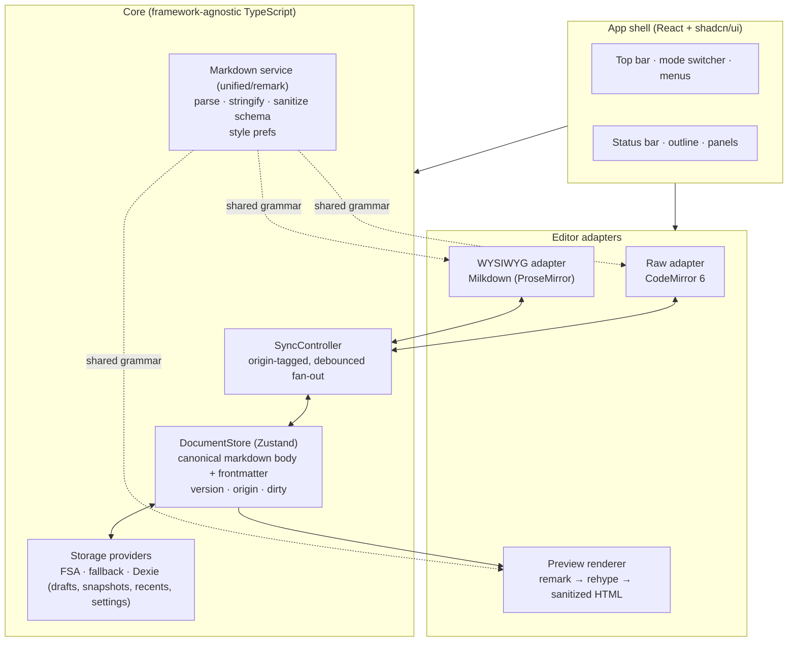

# MarkYou — Implementation Plan

**Version:** 1.0 · **Date:** 2026-07-24 · **Companion to:** [requirements.md](./requirements.md)
**Assumption for estimates:** one experienced frontend engineer, full-time. Ranges are working days.

---

## 1. Architecture overview



**Load-bearing choices**

1. **`DocumentStore` owns one canonical markdown string** (body) plus a parsed frontmatter object. Editors never talk to each other — only to the store through `SyncController`.
2. **Frontmatter is split off at the store boundary.** Raw mode edits the *full text* (frontmatter included); WYSIWYG and preview receive only the body. This keeps YAML out of Milkdown entirely (simplest correct handling of FR-5.12/FR-10.4).
3. **One remark configuration** (plugins + options) is defined once in `core/markdown` and consumed by the preview pipeline and by Milkdown's internal parser/serializer — the "one grammar everywhere" guarantee.
4. **Editors are adapters** implementing a common interface (`getText/applyText/focus/getSelectionAnchor/find…`), so app features (find bar, outline jump, mode switch) don't special-case editor internals.

## 2. Sync engine design (the heart of dual mode)

### 2.1 Store shape

```ts
interface DocState {
  body: string;              // canonical markdown body (no frontmatter)
  frontmatter: FrontmatterState; // parsed map + rawBlock + valid flag
  version: number;           // monotonically increasing
  origin: 'raw' | 'wysiwyg' | 'meta' | 'system'; // author of this version
  dirty: boolean;
  file: FileBinding | null;  // handle/name/permission state
}
```

### 2.2 Update protocol

- **Raw → store:** CM6 `updateListener`, only for user transactions (skip transactions annotated `sync`). Push immediately (cheap), `origin:'raw'`. Raw pushes *full text*; store re-splits frontmatter.
- **WYSIWYG → store:** Milkdown listener (`markdownUpdated`), debounced **300 ms**, `origin:'wysiwyg'`. Serialization runs through the shared stringify options (normalization, D13).
- **Store → raw:** on any version where `origin !== 'raw'`: compute a **minimal text diff** (`fast-diff`) between the CM doc and the new text, dispatch as CM changes annotated `sync`. CM maps selection/scroll through changes automatically → no cursor jumps (FR-6.1).
- **Store → WYSIWYG:** on any version where `origin !== 'wysiwyg'`: debounce **300 ms**, then re-parse body and replace the Milkdown document. Selection restore: capture an anchor (heading path + text offset) before replace, re-seek after. If the WYSIWYG pane is focused *and* actively receiving keystrokes, defer replacement until idle (single user edits one pane at a time — deferral, not merging, is the correct model here).
- **Store → preview:** derived subscription, debounced 200 ms, re-render.

**Loop safety:** three independent guards — origin check, version check, and content-equality short-circuit before any apply. An apply never re-emits (raw: `sync` annotation filter; WYSIWYG: listener muted during programmatic replace).

**Failure isolation (FR-6.4):** parse errors in the WYSIWYG path catch at the adapter, set an error flag rendered as a pane banner, and never write back to the store.

### 2.3 Scroll sync

- **Raw ↔ preview:** a rehype plugin stamps `data-sourcepos` (start line) on block elements from mdast positions. Sync maps CM's top visible line → nearest stamped element (and inverse), with interpolation between anchors. Precise and cheap.
- **Raw/preview ↔ WYSIWYG:** map by **top-level block index** (mdast children ↔ ProseMirror doc children align by construction). Best-effort per FR-6.3.

## 3. Round-trip strategy (D13, §6 of requirements)

1. **Single stringify config** in `core/markdown/style.ts`, fed by user prefs (FR-13.2): `bullet`, `emphasis`, `strong`, `fence`, `listItemIndent`, `rule`. Used by Milkdown's serializer — WYSIWYG output style is therefore deterministic.
2. **Verbatim passthrough:** raw HTML nodes and any unhandled syntax are preserved as opaque nodes (Milkdown keeps `html` nodes; we add an inert-chip NodeView, FR-5.11). Rule: *content the editor can't model must survive untouched.*
3. **Golden corpus in CI** (`tests/roundtrip/`): ~60+ fixture documents (CommonMark suite excerpts, GFM tables/footnotes, math, mermaid, callouts, HTML, pathological nesting, real-world READMEs). Two checked properties:
   - `stringify(parse(x))` is **stable** (idempotent after first normalization: `f(f(x)) === f(x)`), and
   - AST-equivalence: `parse(stringify(parse(x)))` ≡ `parse(x)` (content is never lost or reordered).
4. **Gate:** the corpus must be green before any WYSIWYG feature ships (see M3). This is the project's #1 quality ratchet.

## 4. Repository structure

```
markyou/
├─ docs/                        # this plan + requirements
├─ public/                      # icons, manifest
├─ src/
│  ├─ app/                      # shell: layout, top bar, mode switcher, status bar, menus
│  ├─ components/ui/            # shadcn/ui primitives (owned code)
│  ├─ core/
│  │  ├─ document/              # DocumentStore, frontmatter split/merge, dirty tracking
│  │  ├─ markdown/              # unified pipeline, plugin set, stringify style, sanitize schema, callout transform
│  │  ├─ storage/               # StorageProvider interface · fsa.ts · fallback.ts · db.ts (Dexie: drafts, snapshots, recents, settings)
│  │  └─ sync/                  # SyncController, origins, debouncers, diff-apply, scroll-sync maps
│  ├─ editors/
│  │  ├─ types.ts               # EditorAdapter interface
│  │  ├─ raw/                   # CM6 setup, extensions, theme, search binding, shortcut map
│  │  ├─ wysiwyg/               # Milkdown editor, plugin config, custom nodes (callout, html-chip),
│  │  │                         #   toolbar/bubble/slash wiring, table controls, find plugin
│  │  └─ preview/               # Preview component, sourcepos plugin, mermaid/katex mounting
│  ├─ features/
│  │  ├─ files/                 # open/save/recents/recovery UI flows
│  │  ├─ images/                # paste/drop pipeline, assets writer, resolver (relative → blob URL)
│  │  ├─ find/                  # cross-mode find bar driving adapter APIs
│  │  ├─ outline/               # heading tree from shared AST, jump, active section
│  │  ├─ export/                # html-standalone.ts, print-pdf.ts, copy-rich.ts
│  │  ├─ snapshots/             # scheduler, retention, history panel, diff view (@codemirror/merge)
│  │  └─ settings/              # settings store + dialog, theme controller
│  ├─ styles/                   # tailwind, typography theme (shared: preview/wysiwyg/export), print.css
│  └─ main.tsx
├─ tests/
│  ├─ roundtrip/fixtures/       # golden corpus
│  └─ e2e/                      # Playwright specs
└─ .github/workflows/ci.yml     # typecheck · lint · unit · roundtrip · e2e · bundle-size
```

## 5. Key dependencies

| Area | Packages | Notes |
|---|---|---|
| Build | `vite`, `typescript` (strict), `vite-plugin-pwa` | |
| UI | `react`, `react-dom`, `tailwindcss`, `@tailwindcss/typography`, shadcn/ui (vendored) + `radix-ui` primitives, `lucide-react` | |
| WYSIWYG | `@milkdown/kit` (core, preset-commonmark, preset-gfm, listener, history, clipboard, cursor, indent, block, slash, tooltip), `@milkdown/plugin-math`, `@milkdown/plugin-diagram`, `@milkdown/react`, `@milkdown/crepe` (reference only — we build our own chrome) | Pin exact versions; upgrade deliberately |
| Raw | `codemirror`, `@codemirror/lang-markdown`, `@codemirror/language-data` (lazy), `@codemirror/search`, `@codemirror/merge` (diff view reuse) | |
| Markdown | `unified`, `remark-parse`, `remark-gfm`, `remark-math`, `remark-frontmatter`, `remark-rehype`, `rehype-katex`, `rehype-sanitize`, `rehype-stringify`, custom callout plugin | One config, exported once |
| Rendering extras | `katex`, `mermaid` (lazy chunk), `yaml` | |
| State/data | `zustand`, `dexie`, `fast-diff` | |
| Testing | `vitest`, `@testing-library/react`, `playwright`, `axe-playwright` | |

**Version-risk note:** Milkdown's plugin APIs move between minors. Lock the version set at M3 start, write the custom nodes against it, and batch upgrades with the round-trip corpus as the safety net.

## 6. Milestones

Order rationale: storage before editors (every editor test wants real open/save); raw+preview before WYSIWYG (the shared pipeline and typography get proven on the simple mode first); WYSIWYG before dual (dual is a composition of two finished panes); polish last against real features.

### M0 — Foundation (2–3 d)
Scaffold Vite + React + TS strict + Tailwind + shadcn/ui; ESLint/Prettier; CI pipeline (typecheck, lint, unit, bundle-size budget); PWA manifest + service worker shell; app shell with top bar, empty pane region, status bar, theme switch (light/dark/system).
**Done when:** deployable empty shell, CI green, theme toggle works, Lighthouse PWA installable.

### M1 — Document core & storage (4–6 d)
`DocumentStore` + frontmatter split/merge (`yaml`); `StorageProvider` interface with FSA provider (open/save/save-as, persisted handles, permission re-prompt) and fallback provider (file input / download); Dexie schema (drafts, recents, snapshots, settings); draft guard (≤ 1 s idle write) + recovery banner with diff preview; recents on welcome screen; dirty indicator + `beforeunload`; drag-drop file open; a plain `<textarea>` as placeholder editor to exercise everything end-to-end.
**Done when:** FR-1 acceptance passes on Tier-1 and Tier-2 browsers (kill-tab recovery demo included).

### M2 — Raw mode + preview (4–6 d)
CM6 adapter (markdown lang, nested fences, list continuation, auto-pair, multiple cursors, line numbers, source-level formatting shortcuts, search panel); shared unified pipeline with **all** flavor extensions incl. custom callout transform + `rehype-sanitize` schema + KaTeX + lazy Mermaid; typography theme (shared CSS for preview/WYSIWYG/export); preview pane with debounce; `data-sourcepos` scroll sync both directions; preview toggle; outline data source (heading tree from the shared AST).
**Done when:** FR-3, FR-4 pass; flavor table §6 renders correctly in preview; scroll sync feels anchored, not proportional.

### M3 — WYSIWYG core + round-trip gate (8–12 d) ← *highest-risk milestone*
Milkdown editor on preset-commonmark + preset-gfm + history/clipboard/cursor/indent/listener; stringify style prefs wired into its serializer; **golden corpus built and green** (idempotence + AST-equivalence); math plugin with source-popover editing; diagram plugin with click-to-edit; **custom callout node** (blockquote-derived schema + NodeView + type picker); **HTML-chip NodeView** (verbatim passthrough, popover source edit); fixed toolbar with selection-state reflection; full shortcut set + input rules; link edit popover; code block language picker with highlighting; table editing controls (add/remove/align, Tab navigation); paste rich → markdown, copy → md + rich.
**Done when:** FR-5.1–5.3, 5.7–5.13 pass; round-trip corpus green in CI (release ratchet from here on); a nontrivial README edits comfortably with zero syntax leakage.

### M4 — WYSIWYG UX polish (5–8 d)
Bubble menu (tooltip plugin; selection-aware, collision-aware); slash commands (filterable, keyboard-first, all insertable blocks); drag handles + insert-below affordance (block plugin) with drop indicator; empty-doc placeholder, focus styles, smooth-scroll behaviors; Docs-like page presentation (centered measure, spacing).
**Done when:** FR-5.4–5.6 pass; the mode demos convincingly "like Google Docs" to a non-technical user.

### M5 — Dual mode & sync (4–6 d)
`SyncController` with the §2 protocol (origins, versions, equality short-circuit, `fast-diff` apply into CM, deferred replace into Milkdown, selection anchors); splitter layout with persisted sizes; block-index scroll sync; parse-failure isolation banner (FR-6.4); perf guard: typing in either pane at 60 fps on the 100 KB fixture, sync ≤ 500 ms; history-reset semantics per FR-5.14 documented in-code.
**Done when:** FR-6 passes; an automated "type in both panes alternately" E2E shows no loops, no cursor jumps, no divergence (store equals both panes at idle).

### M6 — Document features (6–9 d)
**Images:** paste/drop in all modes → assets writer (folder permission flow, naming, relative link) with base64 fallback + size warning; resolver service (relative path → blob URL) for preview/WYSIWYG; placeholder + grant-access prompt.
**Find & replace:** app-level find bar driving adapter APIs; CM search bridge; custom ProseMirror find/replace plugin (decorations, replace transactions).
**Outline & counts:** sidebar tree, jump per mode, active-section highlight; status-bar counts incl. selection scope.
**Export:** standalone HTML (inline typography CSS + KaTeX CSS + pre-rendered mermaid SVG + embedded images); print stylesheet + print-to-PDF flow (page-break rules); copy-as-rich-text.
**Snapshots:** save/interval scheduler + retention; history panel; diff via `@codemirror/merge`; restore with pre-restore snapshot.
**Metadata panel:** frontmatter key/value editing + invalid-YAML fallback.
**Done when:** FR-8 through FR-12 + FR-10.4 pass.

### M7 — Responsive & accessibility (4–6 d)
Small-screen shell (single pane, collapsed toolbar + overflow sheet, drawers for outline/menus, `visualViewport` keyboard insets); touch pass on real iOS Safari + Android Chrome (bubble menu as primary surface); keyboard audit (roving tabindex toolbar, focus traps, Esc chains); ARIA + axe run; reduced-motion; contrast check both themes.
**Done when:** Tier-3 experience per matrix; axe: no serious violations; full keyboard-only session possible.

### M8 — Hardening & release (4–6 d)
Performance: bundle analysis vs budgets, lazy-chunk verification (KaTeX/mermaid/CM languages), 1 MB fixture behavior, optional worker offload for preview parse if budgets miss; error boundaries + storage-failure UX; E2E suite completion (lifecycle, three modes, sync, images, export, recovery); cross-browser matrix run; README + user-facing shortcuts/help sheet; version tag.
**Done when:** §9 release criteria of requirements.md fully check off.

**Total: 41–62 dev-days (~8–13 weeks solo).** Critical path: M0 → M1 → M2 → M3 → M5. M4 and M6 can interleave after M3; M7/M8 close.

## 7. Testing strategy

| Layer | Tooling | What it protects |
|---|---|---|
| Round-trip corpus | Vitest + fixtures | D13 semantics: idempotent normalization, zero content loss (the ratchet — grows with every parser/serializer bug found, never shrinks) |
| Unit | Vitest | frontmatter split/merge, stringify style mapping, sync protocol (origin/version/equality guards, simulated interleavings), storage providers (mocked FSA), snapshot retention, image naming |
| Component | Testing Library | toolbar state reflection, find bar, panels, recovery banner |
| E2E | Playwright (chromium + firefox + webkit) | lifecycle incl. kill-and-recover, mode switching with position keep, dual-mode alternating typing (no divergence), paste-image, export artifacts, keyboard-only session, axe |
| Perf | CI bundle-size budget + Playwright timing probes on fixtures (100 KB / 1 MB) | §7 budgets regression |

## 8. Risk register

| # | Risk | L | I | Mitigation |
|---|---|---|---|---|
| R1 | Round-trip edge cases mangle documents | H | H | Corpus-first development (M3 gate), verbatim-passthrough rule, normalize policy is *documented* behavior, ratchet in CI |
| R2 | Dual-pane sync loops / cursor jumps / divergence | M | H | §2 protocol (three guards), diff-apply not replace on the CM side, deferred replace on the PM side, dedicated interleaving E2E |
| R3 | Milkdown customization depth (callouts, find, HTML chips exceed plugin surface) | M | M | Budgeted in M3/M6; escape hatch: drop to ProseMirror APIs (Milkdown exposes them); version pinning |
| R4 | FSA gaps on Firefox/Safari confuse users | H | M | Explicit Tier-2 UX copy ("save a copy"), capability detection, base64 image fallback, Playwright webkit/firefox coverage |
| R5 | Mobile WYSIWYG quirks (selection, IME, keyboard overlap) | M | M | Bubble-menu-first touch design, real-device pass in M7, dual mode excluded on mobile by design |
| R6 | Large-doc performance (1 MB) | M | M | Debounces, minimal-diff applies, lazy chunks, perf fixtures in CI, worker offload as reserved lever (M8) |
| R7 | Mermaid bundle/perf | L | M | Lazy chunk on first use, render cache keyed by code hash, precache after first use via SW |
| R8 | Milkdown upstream API churn | M | L | Exact version pinning; upgrades as deliberate batches validated by the corpus |

## 9. First concrete steps (M0 kickoff checklist)

1. `npm create vite@latest . -- --template react-ts` → strict TS, path aliases.
2. Tailwind + shadcn/ui init; base tokens for light/dark; `lucide-react`.
3. ESLint (typescript-eslint, react-hooks) + Prettier + `lint-staged`.
4. CI workflow: install → typecheck → lint → test → build → bundle-size check.
5. App shell: top bar (title, mode segmented control, menu button, theme toggle), pane placeholder, status bar.
6. `vite-plugin-pwa` with minimal manifest + icons.
7. Commit conventions + `docs/` linked from README.
