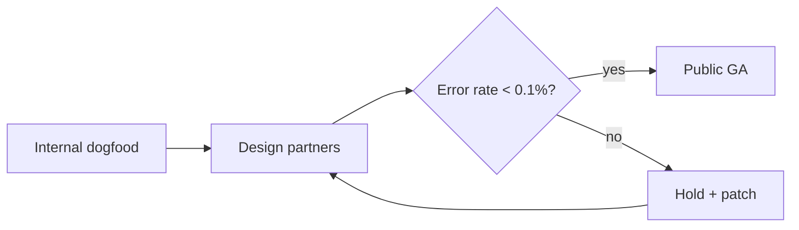

# Aurora — Launch Plan

Aurora ships to general availability on **March 14**. This document is the
single source of truth for scope, sequencing, and the rollback plan.

> [!note] Status
> Beta is feature-complete. The remaining work is hardening, not building.

## Scope

- [x] Streaming ingest pipeline
- [x] Regional failover
- [ ] Usage dashboard
- [ ] Public API docs

| Workstream | Owner | Confidence |
| ---------- | ----- | ---------- |
| Ingest     | Priya | High       |
| Failover   | Tom   | High       |
| Dashboard  | Wei   | Medium     |

## Rollout sequence



## Capacity model

We size the fleet so that queue depth stays bounded. With arrival rate
$\lambda$ and service rate $\mu$, the expected wait is:

$$
W_q = \frac{\rho}{\mu - \lambda}, \qquad \rho = \frac{\lambda}{\mu}
$$

At the projected $\lambda = 840\ \text{req/s}$ we need **six** ingest nodes to
keep $\rho$ under `0.7`.[^1]

[^1]: Measured against the February load test, not extrapolated.

## Rollback

If error rate crosses 0.5% for five consecutive minutes, flip the feature gate:

```ts
await gates.set('aurora.ga', {
  enabled: false,
  reason: 'automated rollback',
});
```

Traffic drains to the previous build within ~90 seconds. No data migration is
required, so rollback is [fully reversible](https://example.com/runbook).
