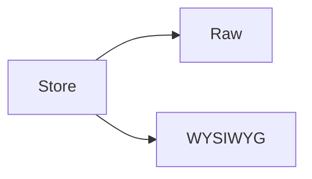

# MarkYou

A local-first markdown editor. See the [docs](https://example.com/docs).

## Features

- **Three modes** — raw, WYSIWYG, dual
- **Offline-first** with PWA support
- [x] Round-trip safety
- [ ] Cloud sync (out of scope)

## Install

```sh
npm install
npm run dev
```

> [!NOTE]
> Node 20+ is required.

## Architecture



The sync debounce is $t = 300$ ms.

| Mode | Engine |
| ---- | ------ |
| Raw | CodeMirror 6 |
| WYSIWYG | Milkdown |

<details>
<summary>Advanced</summary>

Set `VITE_DEBUG=1` for verbose logs.

</details>

---

MIT licensed.[^license]

[^license]: See the LICENSE file.
